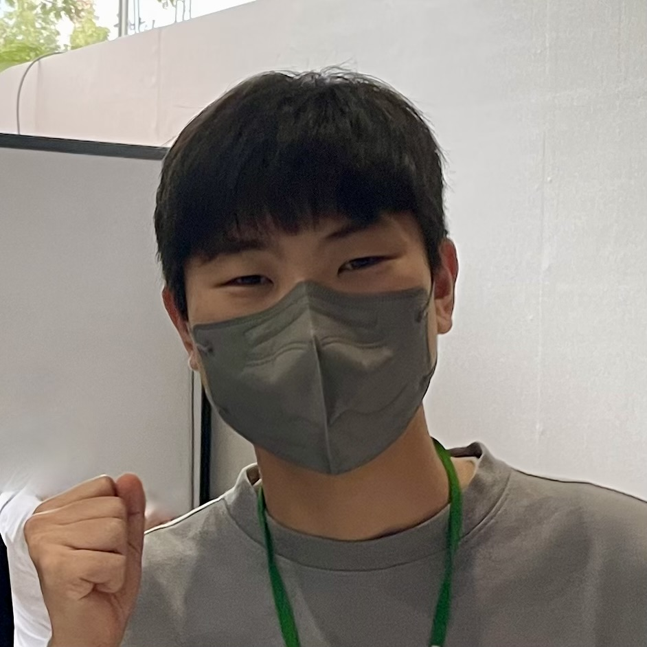

# RESUME

수정일: 2022년 10월 2일 오전 1:35

깊은 생각을 통해 최선의 개발을하는 개발자입니다.

필요한 정보를 필요할 때 사용하는 것에 관심이 많습니다.

- [root@okdohyuk.dev](mailto:root@okdohyuk.dev)
- [personal site](https://okdohyuk.dev)

# 경력

## [닥터다이어리(2022.03 ~ 재직 중)](https://web.drdiary.co.kr/)

> 당뇨병 관리를 중심으로 만성질환 관리를 돕는 디지털 헬스케어 서비스
>

<aside>
🤹 프론트엔드 엔지니어 - `NextJS` `MobX` `Node` `Express` `MongoDB` `Docker`

</aside>

- 건강관리 구독 서비스인 닥터다이어리 클래스 1:1 코칭에 코치님들이 사용하는 대시보드 페이지를 신규 개발하였습니다.
- 비회원으로 체험단을 신청할 수 있고, 당첨시 회원으로 연동해주는 페이지를 개발하여 기존 체험단 참여자 수를 3배 증가시켰습니다.
- 신규 웹 프로젝트에서 Docker를 이용한 무중단 가상환경 CI/CD를 구축하였습니다.
- 닥터다이어리 웹버전을 신규개발 및 유지보수하였습니다.

## [모예(2021.09 ~ 2022.02)](http://bobbinjournal.com/archives/20514)

> 불필요한 재고를 없애고 신입 패션 디자이너를 돕는 패션 프리오더 서비스
>

<aside>
🤹 프론트엔드 엔지니어 - `React Native` `React` `Nextjs` `Redux` `styled-components`

</aside>

- React Native기반 앱서비스(ios, android)를 개발 및 유지보수하였습니다.
- 모예 웹 리뉴얼작업에 참여하였습니다.
- 기존 NFT 토큰 방식의 인증방식에서 OAuth 2.0 기반의 refarsh token 방식의 인증방식으로 개편했습니다.
- Redux-Saga 미들웨어 기반의 코어 유지보수작업을 했습니다.
- 모예 스토어 개발에 참여하였습니다.